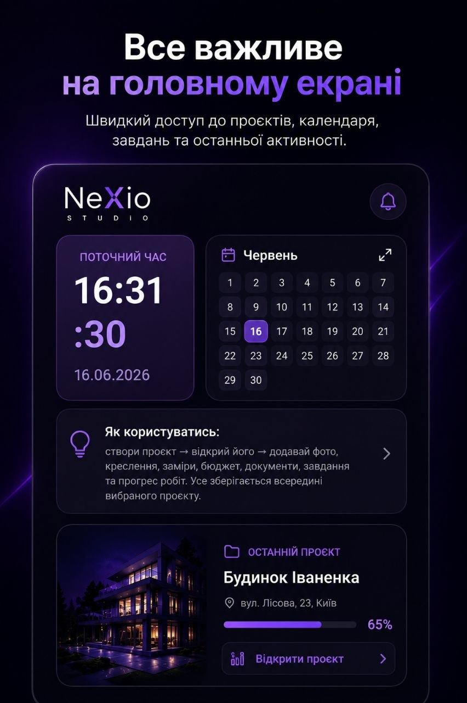
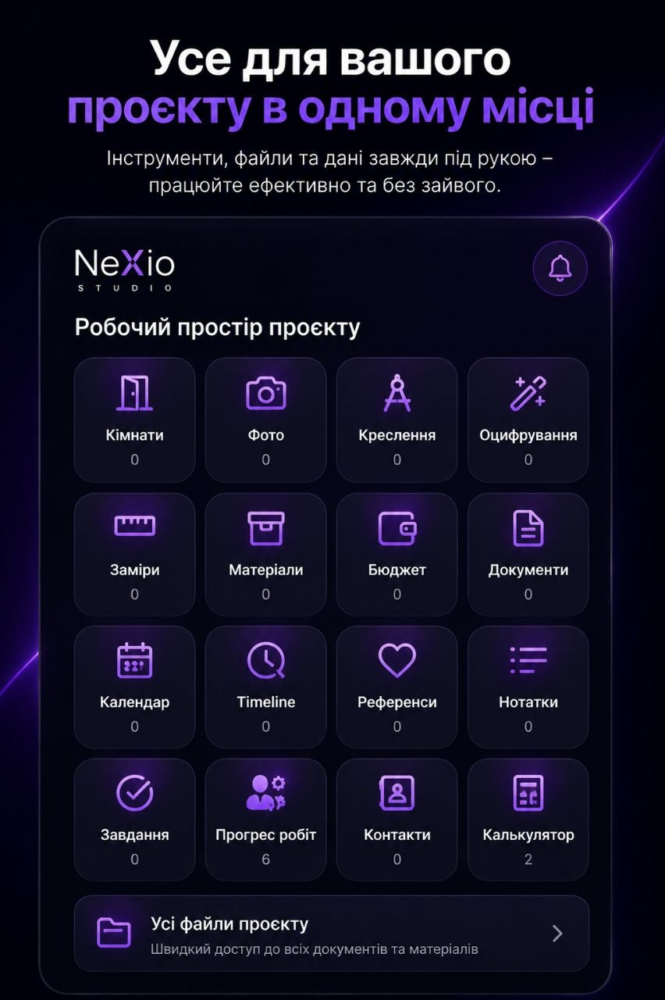
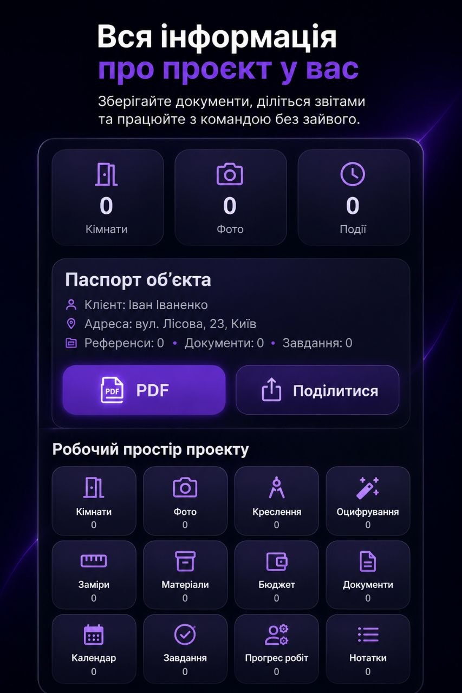

# NeXio-Studio

## Professional Interior Design & Architecture Platform

NeXio-Studio is a modern Flutter application created for interior designers, architects, and design studios.

## Main Features

- Project management
- Client database
- Interior planning
- Drawing management
- Measurements
- Material tracking
- Budget management
- PDF reports
- Calendar and reminders
- Photo gallery
- Offline functionality

## Professional Tools

- Interior project organization
- Architecture planning
- Material calculations
- Budget tracking
- Client management
- Document storage
- Smart project workflow

## Advantages

- Modern interface
- Professional workflow
- Offline database
- Flutter technology
- Easy project management

## Target Users

- Interior designers
- Architects
- Design studios
- Construction professionals
- Private clients

## Technology

- Flutter
- Android
- Offline Database
- PDF Export

---

NeXio © Professional Design Solutions
## Application Screenshots

### Main Workspace

### Project Management

### Interior Planning

### Drawing Tools

### Material & Budget Management

